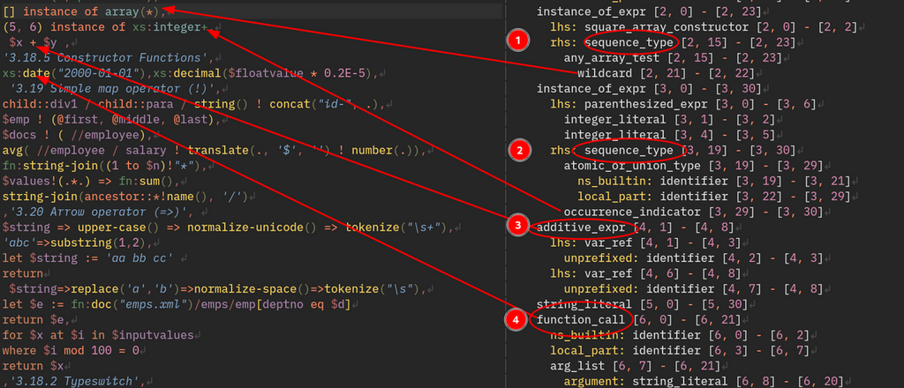

# tree-sitter-xQuery

A tree-sitter grammar is built for an as-you-type experience in a text editor.

The aim is to provide fast identification of syntax tree parts that enable
text highlighting, indenting, folding, scope info and more for a text editor.

The incremental tree-sitter parse should be a step above text highlighting with regular
expressions, however tree-sitter should not be confused with a validating parser. Unlike a 
validating parser, tree-sitter will not stop on-error, but continue to parse and provide
a syntatic highlighting.

- [tree-sitter presentation](https://www.youtube.com/watch?v=Jes3bD6P0To) - a new parsing system for programming tools
- [why tree sitter](https://github.com/github/semantic/blob/master/docs/why-tree-sitter.md) - github semantic team


## tree-sitter web playground 

Visit the interactive treesitter web [playground](https://grantmacken.github.io/tree-sitter-xquery) to see the 
XQuery treesitter in action.


## building

Both Make and Yarn are required to use this repo used so you will need to install both.
Clone and cd into this repo then run `make install` which will use Yarn to install the tree-sitter cli.


 All the work is done in the grammar.js file

The repo contains a Makefile as I use `make` for treeitter aliases.
The default `make` target is an alias for `tree-sitter generate` which will create tree-sitter files from the grammar

To see other make targets type `make help`

## testing gaols: 1, 2, 3 

1. `make parse-all` The parser **SHOULD NOT** throw a parse error with any **valid** xQuery module text.
2. `make test-all` All tree-sitter tests in the test/corpus **should not** error
3. `make query-all` The query capture S-expressions **should not** error

Tests are run via [github actions](https://github.com/grantmacken/tree-sitter-xQuery/actions)

The parsing examples that are derived from the [W3C xQuery recommendation](https://www.w3.org/TR/xquery-31)
are found in the 'examples/spec' folder. Other parse examples are from the [qt3tests suite](https://github.com/w3c/qt3tests) and are in the examples/qt3tests folder

The `test/corpus/` tree-sitter tests are mainly organised around the sections outlined in the 
[W3C xQuery recommendation](https://www.w3.org/TR/xquery-31).

To peek at tree-sitter highlight captures in action, I run some query examples in 
[github actions](https://github.com/grantmacken/tree-sitter-xQuery/actions)
which you might want to look at. 

## using tree-sitter with neovim

 - [Video: Neovim Treesitter](https://www.youtube.com/watch?v=xQGbhiUbSmM)
 - [Video: Tree sitter & LSP: Short Comparison](https://www.youtube.com/watch?v=c17j09vY5sw)

Follow the instuctions at
[Github: nvim-treesitter ](https://github.com/nvim-treesitter/nvim-treesitter#adding-parsers)
to use the xquery treesitter

```
local parser_config = require("nvim-treesitter.parsers").get_parser_configs()
parser_config.xquery = {
  install_info = {
    url = "~/projects/grantmacken/tree-sitter-xquery", -- where you have cloned this project
    files = {"src/parser.c"}
  }
}

```
## better symantic highlighting: example in neovim



1. '\*' in the context of sequence_type/any_array_test/wildcard 
2. '+'  in the context of sequence_type/occurarance_operator
3. '+'  in the context of additive_expr so colored as an operator
4. 'xs:date' in this context is a constuctor function so it is colored as a function, whereas elsewhere as the 2nd line 'xs:integer' this appears in the 
sequence_type context so it will be colored as a type.

More spot the semantic color differences
 - '[' ']' can be a square array constructors or delimit predicates
 - '(' ')' can be a parenthesized expr or delimit parameter and argument lists

## Contributing, Discussions and Issues

[Contributions](CONTRIBUTING.md) and suggestions in form of 
[issues](https://github.com/grantmacken/tree-sitter-xquery/issues) are welcome.


